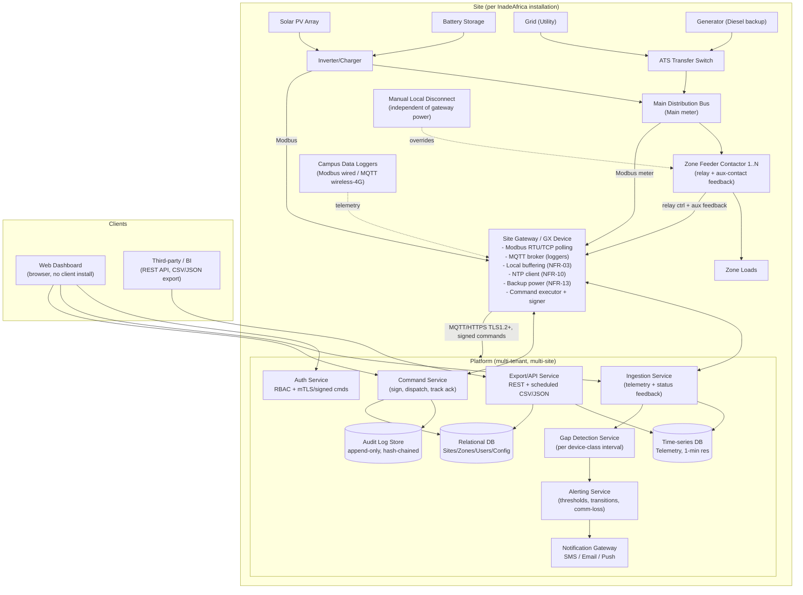
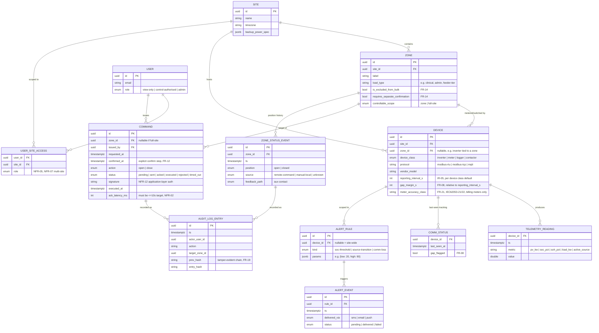
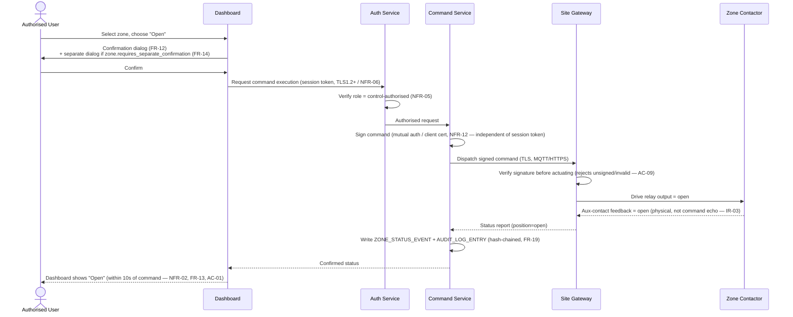

# InadeAfrica EMS — Implementation Blueprint

Companion engineering blueprint for `InadeAfrica_EMS_Technical_Requirements_v1.3.pdf`. The TRD defines *what* the
system must do (FR/NFR/IR IDs); this document defines *how* to build it — architecture, data model, protocols,
security design, phased delivery plan, and a full requirement-to-component traceability matrix.

Every design decision below is traceable back to a TRD requirement ID. Where the TRD leaves a figure open
(Section 9), this blueprint proposes a default and flags it so it stays visible instead of getting silently
baked in.

---

## 1. Architecture Overview

Three tiers: **field layer** (per-site hardware), **platform layer** (cloud/central backend), **presentation
layer** (dashboard/API consumers). The field layer is designed to keep working — logging, alerting, and manual
shutdown — with zero connectivity to the platform layer (NFR-03, NFR-09, FR-20).



**Design principle driving the split:** everything required for stakeholder need *"never lose the ability to cut
power if the network or platform is down"* (FR-20, NFR-09) and *"local logging continues during connectivity
loss"* (NFR-03) must have zero runtime dependency on the cloud tier. The gateway is a first-class control point,
not a dumb relay.

---

## 2. Field Layer

### 2.1 Site Gateway / GX Device
- Aggregates all on-site Modbus RTU/TCP traffic (inverters, battery BMS, meters) — IR-01.
- Runs a local MQTT broker for wireless/4G campus data loggers — IR-02.
- Buffers telemetry to local disk (ring-buffered, capacity sized to expected outage duration) and replays on
  reconnection — NFR-03, AC-04.
- Syncs to NTP within 5s of reference; loggers and controllers sync from the gateway if they lack direct NTP
  reach — NFR-10.
- Runs on gateway backup power (UPS/battery-tap) covering logging + alerting during mains loss — NFR-13 (runtime
  **open** — see §12).
- Hosts the command executor: receives signed shutdown/restore commands from the platform, drives relay outputs,
  reads back auxiliary-contact position, and reports confirmed status — IR-03, FR-13, FR-23.
- Independent of the metering path per IR-03: control wiring (relay/contactor addressing) is physically and
  logically separate from the Modbus telemetry path, so a metering fault can't block a shutdown command.

Recommended base: Victron Cerbo GX / Venus OS class device (already implied by the TRD's "GX device" and
"GX/VRM platform" terminology in Appendix A) extended with a custom control/audit agent, or an equivalent
industrial gateway (Modbus-capable Linux SBC) if inverter brand ends up outside Victron's ecosystem (open item,
§12).

### 2.2 Zone Controllers
- One relay/contactor per controllable zone, IEC 60947-4-1 rated, with a **normally-open auxiliary contact**
  wired back to the gateway's digital input — this is the physical position feedback path (IR-03). Command echo
  (i.e., "I sent open, so I'll show open") is explicitly disallowed as a status source per IR-03/FR-13.
- Zone boundaries and count are a per-site configuration record, not a code constant (Section 9, IR/FR-09,
  FR-10) — see data model §4.
- Each zone carries a `is_excluded_from_bulk` and `requires_separate_confirmation` flag (FR-14), configurable
  per zone at commissioning, driven by load-type classification (clinical, life-safety, etc.) — the *values*
  are an open item (§12) but the *mechanism* must exist from day one.

### 2.3 Manual Local Disconnect
- A physically separate, human-operable disconnect at each zone, wired so it does not route through the gateway
  or draw gateway power to operate — FR-20, NFR-09, verified by AC-07 (de-power the gateway, still able to trip
  the zone).
- Its position feeds the **same** auxiliary-contact status path as the remote contactor (FR-23) — one status
  source of truth per zone, whether the change came from the dashboard or a hand on-site (AC-08).

### 2.4 Campus Data Loggers
- Independent of inverter/battery monitoring; tagged at registration with `site_id`, `zone_id`, `load_tier` —
  IR-02, FR-06.
- Reports at a configurable per-device-class interval (IR-05); the gateway (or platform, if loggers report
  directly over 4G/MQTT to the cloud broker) tracks last-seen-at per device and raises a gap flag once the
  configured margin over that interval elapses — FR-08.

---

## 3. Communication & Protocol Design

| Path | Protocol | Notes |
|---|---|---|
| Inverter/battery/meter ↔ gateway | Modbus RTU (serial) or Modbus TCP | Native protocol, per IR-01. Register maps are brand-specific — locking this requires the open inverter-brand item (§12). |
| Wired campus logger ↔ gateway | Modbus | IR-02 |
| Wireless/4G campus logger ↔ broker | MQTT over TLS | IR-02. Logger can publish directly to a cloud broker or to the gateway's local broker depending on site connectivity — architecture supports both. |
| Zone contactor ↔ gateway | Discrete relay output (command) + discrete digital input (aux-contact feedback) | IR-03. Not a serial/network protocol — physical I/O, by design, so it cannot be spoofed by a network-layer compromise. |
| Gateway ↔ platform (telemetry) | MQTT or HTTPS REST, TLS 1.2+ | NFR-06 |
| Gateway ↔ platform (commands) | HTTPS REST or MQTT, TLS 1.2+ transport **plus** mutually-authenticated, signed command payloads (client cert or command signature) at the application layer | NFR-06 is transport; NFR-12 is a *separate, additional* application-layer control. A stolen dashboard session token must not be sufficient to move a contactor — see §5. |
| Dashboard ↔ platform | HTTPS, browser-only, no client software | IR-04 |
| Export ↔ third parties | REST API (documented, OpenAPI spec) or scheduled CSV/JSON file drop | FR-22, OWASP API Security Top 10 |

Device time sync: gateway is the local NTP client (RFC 5905 / NTPv4) against a public or InadeAfrica-operated
NTP source; downstream field devices without WAN reach sync from the gateway acting as a local NTP relay —
NFR-10.

---

## 4. Data Model



Key modeling decisions tied to specific requirements:
- **`ZONE_STATUS_EVENT.source` distinguishes remote vs. manual-local** but both write to the *same* status
  table/feed — satisfies FR-23 (manual disconnect reports through the same status path as the remote
  contactor) while still preserving provenance for the audit trail.
- **`COMMAND` is never mutated after `executed_at`** — it's insert/append plus status-transition rows, not
  in-place edits, so it composes directly into the tamper-evident audit chain (FR-19, AC-06: "entry is not
  editable").
- **`gap_margin_s` is derived from `reporting_interval_s`, not hardcoded** — directly implements IR-05's
  requirement that FR-08's threshold be set relative to each device class's own interval.
- **`Zone.is_excluded_from_bulk` / `requires_separate_confirmation`** are per-zone booleans, not a fixed
  enum of "clinical/life-safety" — keeps FR-14 configurable per site as the TRD requires, while the actual
  policy of *which* load types get flagged is a commissioning-time decision (open item, §12).
- **Telemetry is a time-series table** (`TELEMETRY_READING`), physically implemented as a hypertable
  (TimescaleDB) or equivalent, partitioned by time, to make retention/downsampling tractable — feeds directly
  into the open storage-volume question in §12.

---

## 5. Control Path Design (Shutdown / Restore)

This is the highest-risk subsystem in the TRD — it's the one the stakeholder needs explicitly call out for
trust ("no ambiguity," "never lose the ability," "compromised login cannot cut power"). Two properties it must
have simultaneously: commands must be fast and unambiguous (NFR-02, FR-13), and the authorization chain must be
strong enough that a compromised dashboard session cannot move a contactor (NFR-06, NFR-12).



Rules baked into this flow:
1. **Confirmation is a UX gate, not a security control.** The thing that actually authorizes a physical state
   change is the signed command at the gateway (NFR-12) — a compromised dashboard *session* alone can't produce
   a validly signed command without also compromising the control-path credential (AC-09).
2. **Status shown on the dashboard is never optimistic.** It only flips after the gateway reports aux-contact
   feedback, not at the moment the command is sent — this is what "trust that displayed status reflects
   physical reality" (a named stakeholder need) actually means in the data flow.
3. **Comm loss mid-flight → last commanded state holds** (NFR-04). This applies only to the supervisory/remote
   path; protective relay/breaker trip logic (over-current, etc.) is out of this software stack entirely and
   must keep operating on its own hardware logic regardless of gateway/network state — the TRD is explicit that
   NFR-04 does not touch protective functions.
4. **Full-site shutdown = fan-out of individual zone commands, minus excluded zones**, not a separate code path
   — this keeps FR-10 (full-site) and FR-14 (exclusion) consistent by construction instead of by convention.

---

## 6. Security Architecture

| Requirement | Control |
|---|---|
| NFR-05 (roles) | Minimum two roles — `view-only`, `control-authorised` — enforced server-side on every command-issuing endpoint, not just hidden in the UI. `admin` role added for zone/site configuration (implied need, not a separate TRD role). |
| NFR-06 (transport security) | TLS 1.2+ on every gateway↔platform and dashboard↔platform channel. No plaintext fallback. |
| NFR-12 (command authentication) | Separate control-path credential from the user session: gateway holds a client certificate or the platform signs each command with a key the gateway independently verifies. This exists *in addition to* NFR-06, not as a substitute — a valid dashboard login is necessary but not sufficient to actuate a zone (AC-09). |
| FR-19 (tamper-evident audit log) | Hash-chained append-only log: each entry stores `hash(entry_data + prev_hash)`; periodic anchoring (e.g., daily digest signed and stored off-system) lets a verifier detect retroactive edits. No UPDATE/DELETE grants on the audit table at the DB role level. |
| FR-22 / OWASP API Top 10 (export API) | Documented REST API, per-endpoint authorization, rate limiting, no BOLA (object-level access checks scoped to the caller's `USER_SITE_ACCESS`), audit-logged export access. |
| Data isolation (NFR-07 multi-site) | Every query path scoped through `USER_SITE_ACCESS`; no cross-site data return without explicit multi-site role. |

---

## 7. Alerting Architecture

- **Trigger sources:** SOC threshold crossing (FR-15, configurable high/low per site or per battery), source
  transition events (FR-16: grid loss / generator start / failover — sourced from `active_source` telemetry
  transitions), comm-loss (FR-17, fed by the same gap-detection mechanism as FR-08/IR-05).
- **Delivery:** pluggable notification gateway supporting SMS, email, and push (FR-18 requires at least one;
  build for all three from the start since the fan-out cost is low and site engineers vs. remote admins will
  want different channels).
- **Delivery is asynchronous and retried**, tracked per `ALERT_EVENT.status`, so a failed SMS doesn't silently
  disappear.

---

## 8. Multi-Site & Scalability

- Platform is multi-tenant from day one: `SITE` is a first-class partition key across telemetry, zones, users,
  and audit log (NFR-07).
- Design floors from NFR-14: **50 zones/site, 20 concurrent sites, 10 concurrent authenticated users** —
  treated as a minimum, not a target; the data model and command dispatch path (§4, §5) have no structural
  ceiling at these numbers (no per-site sharding, no fixed-size zone arrays). Actual scale target is an open
  item pending InadeAfrica's portfolio confirmation (§12).
- Time-series storage should assume horizontal scale-out (TimescaleDB compression + chunking, or a managed
  time-series service) rather than a single unpartitioned table, since 1-minute-resolution × 24-month retention
  × N sites is already flagged as unbounded in the TRD itself (§12).

---

## 9. Technology Stack (Recommendation)

| Layer | Recommendation | Rationale |
|---|---|---|
| Gateway OS/runtime | Linux SBC (Venus OS if Victron-compatible, else Debian-class) + a lightweight agent (Go or Python) | Modbus + MQTT + GPIO control libraries are mature on both; Go favored for the command-signing/execution agent for a static binary and low resource footprint on constrained hardware. |
| Local MQTT broker | Mosquitto | Lightweight, TLS-capable, standard for wireless logger ingestion. |
| Backend services | Go or Node.js/TypeScript microservices (ingestion, command, alerting, export) behind an API gateway | Either is fine; pick whichever the team already has depth in — this is a services-with-clear-boundaries design, not framework-critical. |
| Time-series store | TimescaleDB (Postgres extension) | SQL-native, supports downsampling/continuous aggregates for the 24-month retention question, avoids a second query language. |
| Relational store | PostgreSQL | Sites/zones/users/config/audit log; audit log table with restricted grants (§6). |
| Command transport | MQTT (QoS 1) or HTTPS with mutual TLS | Either satisfies NFR-06/NFR-12 if application-layer signing is added; MQTT preferred for constrained/intermittent links. |
| Frontend | React/TypeScript SPA, WebSocket or SSE for live updates, served over HTTPS | IR-04 (browser-only, no client install); push-based updates comfortably beat the 30s NFR-01 floor. |
| Notifications | Provider-agnostic adapter (e.g., Twilio for SMS, SES/SendGrid for email, FCM/APNs for push) | FR-18. |
| Auth | OIDC/OAuth2 for user sessions + separate mTLS/PKI for gateway↔platform command channel | Keeps NFR-06 and NFR-12 as genuinely independent controls. |

---

## 10. Requirement Traceability Matrix

| TRD ID | Component / Section in this blueprint |
|---|---|
| FR-01–FR-04 | Ingestion Service, Telemetry table, Dashboard live view (§3–4) |
| FR-05 | TSDB retention/downsampling design (§9); volume open item (§12) |
| FR-06, FR-07 | Campus logger ingestion, common time axis via shared `TELEMETRY_READING.ts` (§2.4, §4) |
| FR-08 | Gap Detection Service, `COMM_STATUS`, `gap_margin_s` derived from `reporting_interval_s` (§2.4, §4) |
| FR-09–FR-11 | Command Service, zone control sequence (§5) |
| FR-12, FR-14 | Dashboard confirmation UX + `Zone.requires_separate_confirmation`/`is_excluded_from_bulk` (§5) |
| FR-13, FR-23 | Aux-contact feedback path, `ZONE_STATUS_EVENT` (§2.2–2.3, §5) |
| FR-15–FR-18 | Alerting Service, Notification Gateway (§7) |
| FR-19 | Hash-chained Audit Log Store (§4, §6) |
| FR-20 | Manual Local Disconnect (§2.3) |
| FR-21 | `Device.meter_accuracy_class` field, procurement constraint (§4) |
| FR-22 | Export/API Service (§4, §6) |
| NFR-01 | Push-based dashboard updates (§9) |
| NFR-02 | Command sequence latency budget (§5) |
| NFR-03 | Gateway local buffering (§2.1) |
| NFR-04 | Last-commanded-state hold logic, protective-relay boundary (§5) |
| NFR-05 | Auth Service RBAC (§6) |
| NFR-06 | TLS 1.2+ everywhere (§3, §6) |
| NFR-07 | `USER_SITE_ACCESS`, multi-tenant partitioning (§4, §8) |
| NFR-08 | Documented on-site SAT procedure (§11) |
| NFR-09 | Manual disconnect independence (§2.3) |
| NFR-10 | Gateway NTP client/relay (§3) |
| NFR-11 | Retention policy in TSDB design; volume open item (§12) |
| NFR-12 | Application-layer command signing, independent of NFR-06 (§5, §6) |
| NFR-13 | Gateway backup power spec field; runtime open item (§12) |
| NFR-14 | Multi-tenant scale floors (§8) |
| IR-01–IR-05 | §2–3 throughout |
| AC-01–AC-09 | §11 (mapped to delivery phases) |

---

## 11. Implementation Roadmap

Phased so each phase ends in a demonstrable, testable slice, and Phase 0 clears the open items that otherwise
block committing to a register map, storage budget, or hardware spec.

**Phase 0 — Requirements closure (blocking, no code)**
Resolve the items in §12 with InadeAfrica/site/vendor sign-off: inverter brand(s) per site, zone
count/boundaries per site, excluded-zone load types, backup power runtime, scalability floors vs. actual
portfolio, audit log retention period, telemetry downsampling policy. Add the sign-off block the TRD's
Section 9 calls for.

**Phase 1 — Monitoring core** (FR-01–FR-08, IR-01, IR-02, IR-05, NFR-01, NFR-10)
Gateway Modbus polling + logger MQTT ingestion → TSDB → read-only dashboard with live refresh and gap
detection. No control path yet. *Exit test: AC-03.*

**Phase 2 — Control path** (FR-09–FR-14, FR-19, FR-20, FR-23, NFR-02, NFR-04–NFR-06, NFR-09, NFR-12, IR-03)
Zone relay/aux-contact wiring, command signing, confirmation UX, fail-safe hold logic, manual disconnect,
tamper-evident audit log. This is the phase that needs the most rigor given the trust-in-physical-reality
stakeholder need. *Exit tests: AC-01, AC-02, AC-05, AC-06, AC-07, AC-08, AC-09.*

**Phase 3 — Alerting** (FR-15–FR-18)
Threshold engine, transition detection, notification gateway (SMS/email/push).

**Phase 4 — Data management & multi-site** (FR-21, FR-22, NFR-07, NFR-11, NFR-14)
Export API, meter accuracy procurement gating, multi-site RBAC, retention/downsampling per the Phase 0
decision. *Exit test: AC-04.*

**Phase 5 — FAT/SAT & handover** (TRD §8 in full)
Factory Acceptance Testing on control/switching logic before shipment; Site Acceptance Testing against all
AC-01–AC-09 on-site before handover; NFR-08 documented procedure handed to site engineers.

---

## 12. Open Items Inherited from the TRD (Section 9)

These are **not implementation choices this blueprint can make unilaterally** — they're carried forward as
gating decisions, each mapped to where it plugs into the design above:

| Open item | Where it plugs in |
|---|---|
| Load types requiring excluded/separate-confirmation designation | `Zone.is_excluded_from_bulk`/`requires_separate_confirmation` values (§4) — mechanism is built, policy isn't |
| Inverter brand(s) per site | Locks the Modbus register map (§2.1, §3) — needed before gateway polling code is final |
| User roles/accounts beyond view-only/control-authorised | `USER.role` enum (§4, §6) — extensible, not finalized |
| Enclosure/environmental (IP/temperature) rating for outdoor gateways/loggers | Hardware procurement spec, outside software scope but blocks field deployment |
| NFR-13 backup power runtime (hours) | `SITE.backup_power_spec` (§4) — value TBD |
| NFR-14 scalability floors vs. actual portfolio | §8 — current design has no structural ceiling at the stated floors, but capacity planning/cost needs the real number |
| Audit log retention period (distinct from 24-month telemetry retention) | Audit log store lifecycle policy (§4, §6) — currently undefined, must not default to telemetry's 24 months without a decision |
| Storage/downsampling policy for 1-min telemetry × 24 months × N sites | TSDB continuous-aggregate/compression policy (§9) — flagged unbounded in the TRD; needs a number before Phase 4 |
| Stakeholder sign-off block | Process item — add before this blueprint moves from draft to build-authorized |

---

## 13. Suggested Repository Layout

```
/gateway/          # Edge agent: Modbus polling, MQTT broker config, relay control, command verification, local buffer
/backend/
  /ingestion/       # Telemetry + status ingestion service
  /command/         # Command signing, dispatch, state tracking
  /alerting/        # Threshold engine + notification gateway
  /export/          # REST API + scheduled export jobs
  /auth/            # RBAC, session, gateway PKI management
/frontend/          # Dashboard SPA
/infra/             # IaC for TSDB, Postgres, message broker, deployment
/docs/
  EMS-Implementation-Blueprint.md   # this document
  register-maps/    # per-inverter-brand Modbus register maps (populated once Phase 0 closes)
/test/
  acceptance/       # AC-01..AC-09 automated/scripted test procedures
```
